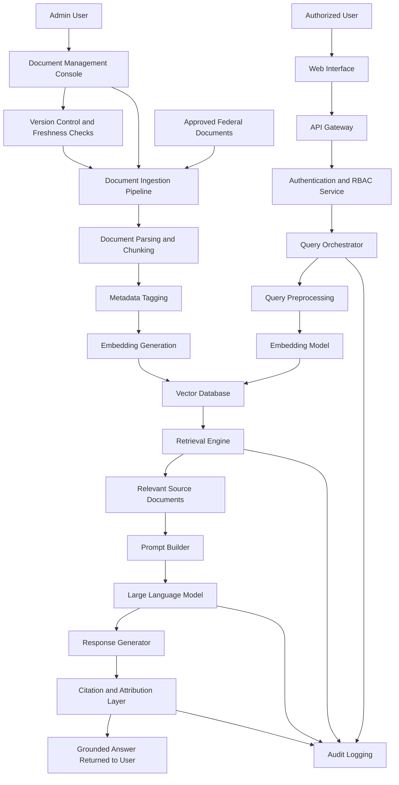

# Architecture Diagram

```mermaid
flowchart TD

    A[Authorized User] --> B[Web Interface]
    B --> C[API Gateway]
    C --> D[Authentication and RBAC Service]

    D --> E[Query Orchestrator]
    E --> F[Query Preprocessing]
    F --> G[Embedding Model]

    G --> H[Vector Database]
    H --> I[Retrieval Engine]
    I --> J[Relevant Source Documents]

    J --> K[Prompt Builder]
    K --> L[Large Language Model]

    L --> M[Response Generator]
    M --> N[Citation and Attribution Layer]
    N --> O[Grounded Answer Returned to User]

    P[Approved Federal Documents] --> Q[Document Ingestion Pipeline]
    Q --> R[Document Parsing and Chunking]
    R --> S[Metadata Tagging]
    S --> T[Embedding Generation]
    T --> H

    E --> U[Audit Logging]
    I --> U
    L --> U
    N --> U

    V[Admin User] --> W[Document Management Console]
    W --> Q
    W --> X[Version Control and Freshness Checks]
    X --> Q
```
