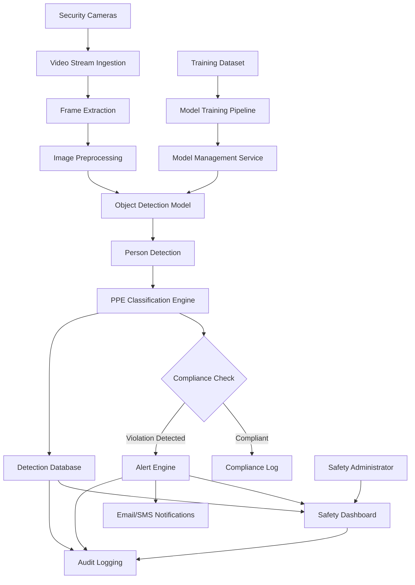

# Architecture Diagram

```mermaid
flowchart TD

    A[Security Cameras] --> B[Video Stream Ingestion]

    B --> C[Frame Extraction]
    C --> D[Image Preprocessing]

    D --> E[Object Detection Model]
    E --> F[Person Detection]

    F --> G[PPE Classification Engine]

    G --> H{Compliance Check}

    H -->|Compliant| I[Compliance Log]

    H -->|Violation Detected| J[Alert Engine]

    J --> K[Safety Dashboard]
    J --> L[Email/SMS Notifications]

    G --> M[Detection Database]

    M --> K

    N[Safety Administrator] --> K

    O[Model Management Service]
    O --> E

    P[Training Dataset]
    P --> Q[Model Training Pipeline]
    Q --> O

    M --> R[Audit Logging]
    J --> R
    K --> R
```
